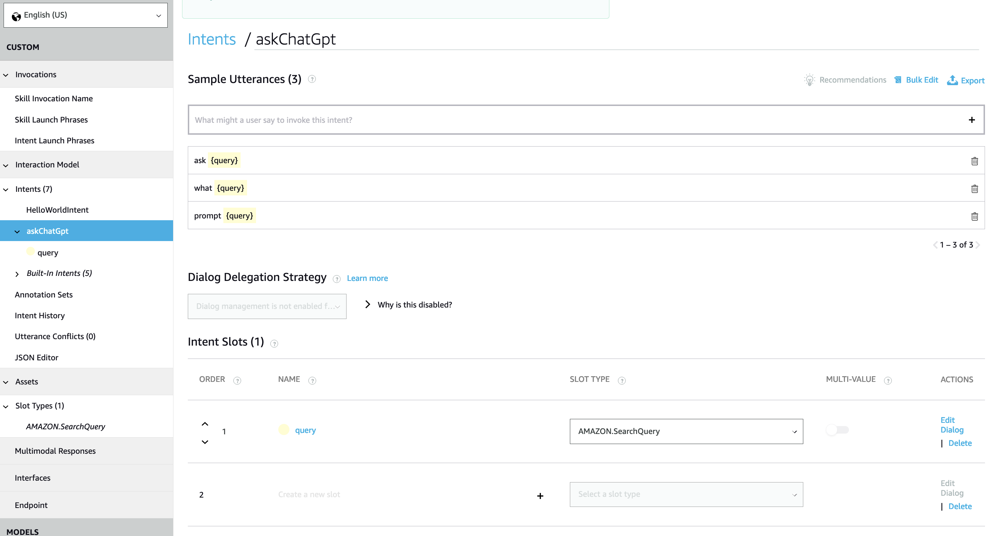
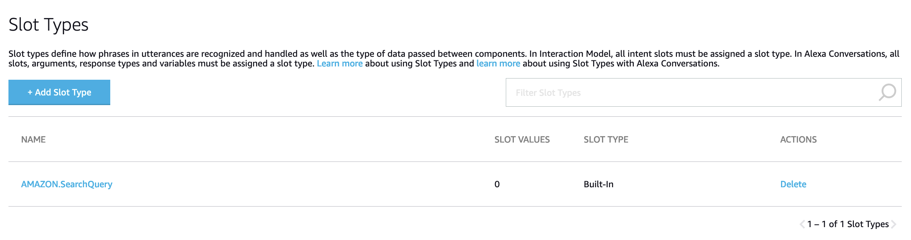

# AlexaGPT

Make your smart speaker actually smart. This serverless function plumbs ChatGPT API into Alexa using AWS Lambda. It's not conversational (yet).

## Setup
- Install [Serverless](https://www.serverless.com) if you don't already have it: `npm i -g serverless`
- `npm i` 
- Create a new [Alexa Skill](https://developer.amazon.com/alexa/console/ask), using the Custom type. Make a note of the Skill ID.
- Create an OpenAI [API Key](https://platform.openai.com/account/api-keys)
- Deploy with: `ALEXA_SKILL_ID=<YOUR SKILL ID> OPENAI_API_KEY=<YOUR API KEY> sls deploy`
- Copy the Lambda ARN into the Alexa Endpoint config
- Configure the query slot type and query intent:

- Add `AMAZON.SearchQuery` as a slot type

- Build your model and test!
